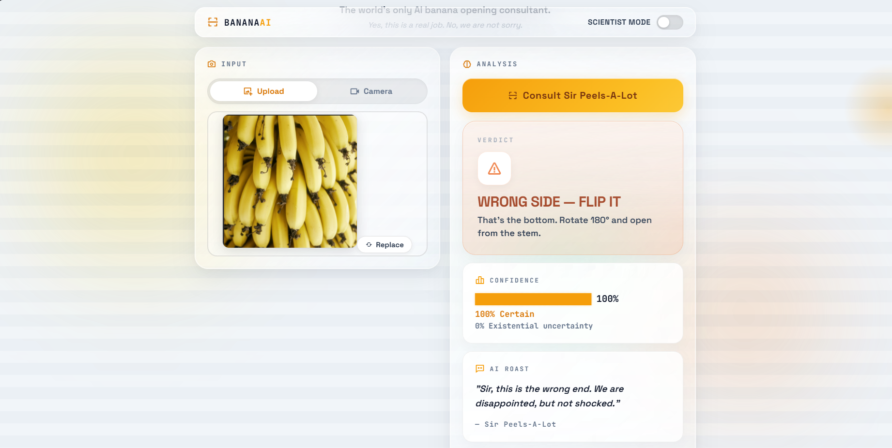
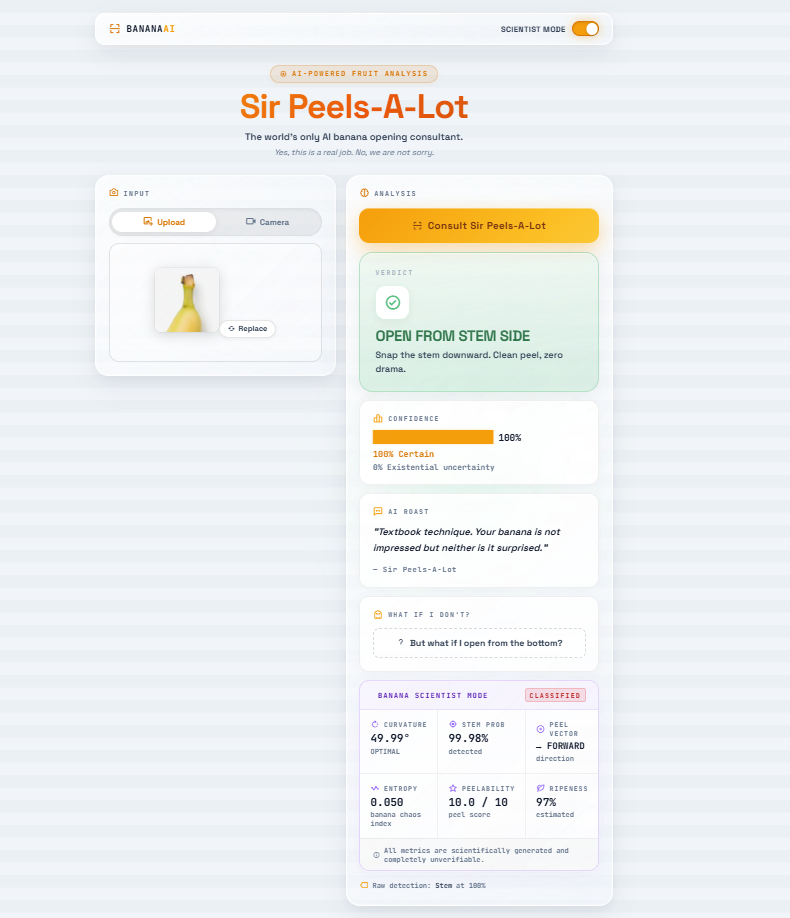

# Sir Peels-A-Lot 🍌🎯

## Basic Details

### Team Name: NULL

### Team Members

* Team Lead: GAUTHAM VINOD - SNGCE
* Member 2: RIZA A - SNGCE

### Project Description

Sir Peels-A-Lot is an AI-powered React web app that solves one of humanity's most ignored problems: **which end of a banana should you open first?**

Using a Teachable Machine image classification model, the app analyzes uploaded banana images or a live webcam feed and confidently tells you whether you should open the **stem side, bottom/blossom side, or absolutely nothing because that's not a banana**.

### The Problem (that doesn't exist)

Every day, millions of people face the unbearable uncertainty of looking at a banana and thinking:

> **"Which side am I supposed to open?"**

Some people open it from the stem.
Some people open it from the bottom.
Some people just bite it.

This project finally addresses this completely unnecessary crisis.

### The Solution (that nobody asked for)

Sir Peels-A-Lot uses AI to inspect your banana and make the decision for you.

Simply upload a banana photo, drag and drop one into the app, or point your webcam at it. The AI then:

* Detects whether there is a banana.
* Identifies the stem side or bottom/blossom side.
* Provides a confidence score.
* Gives you a verdict explaining which end to open.
* Roasts you if necessary.
* Optionally activates **Scientist Mode** to display completely serious-looking banana statistics.

Because apparently, even peeling a banana needs AI.

## Technical Details

### Technologies/Components Used

#### For Software:

* **Languages:** JavaScript, HTML, CSS
* **Framework:** React
* **Build Tool:** Vite
* **AI/ML:** Google Teachable Machine Image Classification
* **Libraries:** TensorFlow.js / Teachable Machine Image Library
* **Tools:** Node.js, npm, Git, GitHub
* **Browser APIs:** Webcam / MediaDevices API

#### For Hardware:

* No dedicated hardware required.
* Laptop/desktop with a modern web browser
* Webcam (optional, for live banana detection)

### Implementation

#### For Software:

# Installation

Clone the repository and install the dependencies:

```bash
git clone [YOUR_GITHUB_REPOSITORY_URL]
cd banana-peel
npm install
```

# Run

Start the Vite development server:

```bash
npm run dev
```

Open the local URL shown in the terminal, usually:

```text
http://localhost:5173
```

### Available Commands

```bash
npm run dev
```

Starts the development server with hot reload.

```bash
npm run build
```

Creates the production build in the `dist/` directory.

```bash
npm run preview
```

Previews the production build locally.

```bash
npm run lint
```

Runs Oxlint against the project.

### Project Documentation

#### For Software:

# Screenshots


[home page](image.png)





# Diagrams


*Workflow showing the process from image/webcam input → Teachable Machine model → classification → confidence calculation → banana verdict and Scientist Mode metrics.*

### How the AI Works

The application uses a hosted **Teachable Machine image classification model**.

The model is loaded using its `model.json` and `metadata.json` files. When an image or webcam frame is provided:

1. The image/video frame is sent to the trained model.
2. The model generates probabilities for each class.
3. The class with the highest probability is selected.
4. The application maps the prediction to one of three outcomes:

   * 🍌 **Stem Side**
   * 🌸 **Bottom/Blossom Side**
   * 🚫 **No Banana**
5. The confidence score is displayed to the user.
6. A playful verdict and AI roast are generated based on the prediction.
7. Scientist Mode can optionally generate additional experimental metrics.

### Model

The current Teachable Machine model is:

```text
https://teachablemachine.withgoogle.com/models/tFKgMid8B/
```

The model expects class names containing keywords such as:

* `stem` → Stem-side verdict
* `bottom` / `blossom` → Bottom-side verdict
* `no banana` / `background` / `none` / `other` / `nothing` → No-banana verdict

To use a different model, update the `MODEL_URL` inside:

```text
src/components/BananaAnalyzer.jsx
```

### Scientist Mode 🧪

Scientist Mode provides additional experimental metrics including:

* Banana curvature
* Stem probability
* Prediction entropy
* Peelability score
* Ripeness estimate

These values are intentionally presented as **playful, generated diagnostics** and should not be treated as scientifically validated measurements.

Because sometimes a banana needs a laboratory report.

### Project Structure

```text
src/
│
├── App.jsx
├── App.css
├── index.css
├── main.jsx
│
└── components/
    ├── ImageInput.jsx
    └── BananaAnalyzer.jsx
│
public/
├── favicon.svg
└── icons.svg
```

### Project Demo

# Video

[Add your demo video link here]

*The demo shows the complete workflow: uploading a banana image, AI classification, confidence scoring, peeling recommendation, webcam analysis, and Scientist Mode.*

# Additional Demos

* GitHub Repository: https://github.com/Gauthamx/banana-peel/
* Live Website: https://banana-peeling.vercel.app
* Teachable Machine Model: https://teachablemachine.withgoogle.com/models/MGa1ic7Im/

## Team Contributions

* **GAUTHAM VINOD:** React application development, UI/UX, AI model integration, and overall project implementation.
* **RIZA A:** Teachable Machine model training, banana image dataset preparation, and testing.Creative concept, Scientist Mode, interaction design, testing, documentation, and presentation.

---

Made with ❤️ at TinkerHub Useless Projects


